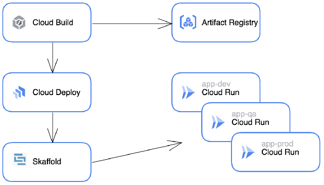

# Deploy Cloud Run Application with Cloud Deploy

## Overview
In this lab, you will deploy a .Net application to Cloud Run using Cloud Deploy. 
You will build a container image with Cloud Build without using Dockerfile. 
You will set up a pipeline with three target environments with Cloud Deploy and go through the steps to promote the release through environments. 
Finally you will approve the release to be deployed to the production environment.



**What is Cloud Build?**

With [Cloud Build](https://cloud.google.com/build) you can build software quickly across all programming languages.

**What is Cloud Deploy?**

[Cloud Deploy](https://cloud.google.com/deploy) is a fully managed continuous delivery service. With Cloud Deploy you can create deployment pipelines for GKE, Anthos and Cloud Run.

**What is Cloud Run?**

With [Cloud Run](https://cloud.google.com/run) you can deploy scalable containerized applications written in any language (including Go, Python, Java, Node.js, .NET, and Ruby) on a fully managed platform.

**What is Skaffold?**

Skaffold is a command-line tool that enables continuous development for Kubernetes-native applications.

[Cloud Deploy uses Skaffold](https://cloud.google.com/deploy/docs/using-skaffold) for render and deploy operations.

## Environment Setup
Make sure you're using gcloud CLI version 402.0.0 or greater.

Check current version:
```shell
gcloud version
```

Update to the latest:
```shell
gcloud components update
```

Set project environment variables:
```shell
export PROJECT_ID=$(gcloud config get-value project)
export PROJECT_NUMBER=$(gcloud projects describe $PROJECT_ID \
--format='value(projectNumber)')
export REGION=us-central1
```

Enable APIs:
```shell
gcloud services enable \
  run.googleapis.com \
  cloudbuild.googleapis.com \
  clouddeploy.googleapis.com \
  artifactregistry.googleapis.com
```

Create Artifact Registry repository:
```shell
gcloud artifacts repositories create containers-repo \
  --repository-format=docker \
  --location=${REGION} \
  --description="Containers repository"
```

## Review configuration files


Clone application source code:
```shell
git clone https://github.com/gitrey/deploy-cloudrun-app-with-clouddeploy.git
cd deploy-cloudrun-app-with-clouddeploy
```
Review Cloud Deploy pipeline config - `clouddeploy.yaml`
```yaml
apiVersion: deploy.cloud.google.com/v1
kind: DeliveryPipeline
metadata:
 name: cloud-run-pipeline
description: application deployment pipeline
serialPipeline:
 stages:
 - targetId: dev-env
   profiles: [dev]
 - targetId: qa-env
   profiles: [qa]
 - targetId: prod-env
   profiles: [prod]
---

apiVersion: deploy.cloud.google.com/v1
kind: Target
metadata:
 name: dev-env
description: Cloud Run development service
run:
 location: projects/_PROJECT_ID/locations/us-west1
---

apiVersion: deploy.cloud.google.com/v1
kind: Target
metadata:
 name: qa-env
description: Cloud Run QA service
run:
 location: projects/_PROJECT_ID/locations/us-central1
---

apiVersion: deploy.cloud.google.com/v1
kind: Target
metadata:
 name: prod-env
description: Cloud Run PROD service
run:
 location: projects/_PROJECT_ID/locations/us-south1
```

Review `skaffold.yaml` file that defines three environments, and it's using Cloud Run as target service.
```yaml
apiVersion: skaffold/v3alpha1
kind: Config
metadata: 
  name: cloud-run-app
profiles:
- name: dev
  manifests:
    rawYaml:
    - deploy-dev.yaml
- name: qa
  manifests:
    rawYaml:
    - deploy-qa.yaml
- name: prod
  manifests:
    rawYaml:
    - deploy-prod.yaml
deploy:
  cloudrun: {}
```

Review service configuration files.

`deploy-dev.yaml`
```yaml
apiVersion: serving.knative.dev/v1
kind: Service
metadata:
  name: app-dev
spec:
  template:
    spec:
      containers:
      - image: app
        resources:
          limits:
            cpu: 1000m
            memory: 128Mi
```
`deploy-qa.yaml`
```yaml
apiVersion: serving.knative.dev/v1
kind: Service
metadata:
  name: app-qa
spec:
  template:
    spec:
      containers:
      - image: app
```
`deploy-prod.yaml`
```yaml
apiVersion: serving.knative.dev/v1
kind: Service
metadata:
  name: app-prod
spec:
  template:
    spec:
      containers:
      - image: app
```

Review `cloudbuild.yaml` file with steps to build a container image and to create Cloud Deploy release:
```shell
steps:
- name: 'gcr.io/k8s-skaffold/pack'
  entrypoint: 'pack'
  args: ['build',
         '--builder=gcr.io/buildpacks/builder',
         '--publish', '${_REGION}-docker.pkg.dev/${PROJECT_ID}/containers-repo/app:$BUILD_ID']
  id: Build and package .net app
- name: gcr.io/google.com/cloudsdktool/cloud-sdk:slim
  args: 
      [
        "deploy", "releases", "create", "release-$_RELEASE_TIMESTAMP",
        "--delivery-pipeline", "cloud-run-pipeline",
        "--region", "${_REGION}",
        "--images", "app=${_REGION}-docker.pkg.dev/${PROJECT_ID}/containers-repo/app:$BUILD_ID"
      ]
  entrypoint: gcloud
```

## Create Cloud Deploy Pipeline

Replace _PROJECT_ID value in the `clouddeploy.yaml`:
```shell
sed -i "s/_PROJECT_ID/$PROJECT_ID/g" clouddeploy.yaml
```

Create Cloud Deploy pipeline:
```shell
gcloud deploy apply \
  --file=clouddeploy.yaml \
  --region=${REGION} \
  --project=${PROJECT_ID}
```

Review created pipeline in Cloud Deploy.

## Build Container image and create a release

Add Cloud Deploy Operator permissions to Cloud Build service account:
```shell
gcloud projects add-iam-policy-binding ${PROJECT_ID} \
    --member=serviceAccount:${PROJECT_NUMBER}@cloudbuild.gserviceaccount.com \
    --role=roles/clouddeploy.operator

gcloud projects add-iam-policy-binding ${PROJECT_ID} \
    --member=serviceAccount:${PROJECT_NUMBER}@cloudbuild.gserviceaccount.com \
    --role=roles/iam.serviceAccountUser
```

Create Cloud Deploy release:
```shell
export RELEASE_TIMESTAMP=$(date '+%Y%m%d-%H%M%S')

gcloud builds submit \
  --config cloudbuild.yaml \
  --substitutions=_REGION=${REGION},_RELEASE_TIMESTAMP=${RELEASE_TIMESTAMP}
```

Review created release in Cloud Deploy. Wait until deployment to the Dev environment is complete.

## Promote release to QA and PROD environments

Using Cloud Console or Cloud Shell, promote release to the next target(qa-env).

Promote the release with Cloud Shell, run gcloud command to promote the release.
```shell
gcloud beta deploy releases promote \
    --release="release-${RELEASE_TIMESTAMP}" \
    --delivery-pipeline=cloud-run-pipeline \
    --region=${REGION} \
    --quiet
```

Wait until deployment to QA environment is done. Promote release to the next target(prod-env).

```shell
gcloud beta deploy releases promote \
    --release="release-${RELEASE_TIMESTAMP}" \
    --delivery-pipeline=cloud-run-pipeline \
    --region=${REGION} \
    --quiet
```
Open Cloud Deploy in Cloud Console and approve the release for production deployment.


Review Cloud Deploy pipeline state and available [DORA metrics](https://cloud.google.com/deploy/docs/metrics?_ga=2.157539578.-1719619211.1663508373) ("deployment count", "deployment frequency", "deployment failure rate").


| Metric                  | Description                                                                                                                                                        |
|-------------------------|---------------------------------------------------------------------------------------------------------------------------------------------------------------------------------|
| Number of deployments   | The total number of successful and failed deployments to the final target in your delivery pipeline.                                                                            | 
| Deployment frequency    | How often the delivery pipeline deploys to the final target in your delivery pipeline.<br/>One of the four key metrics defined by the DevOps Research and Assessment (DORA) program. | 
| Deployment failure rate | The percentage of failed rollouts to the final target in your delivery pipeline.                                                                                                | 

Review deployed applications in Cloud Run:


## Test deployed applications

Run command below in the Cloud Shell.

```shell
REGION=us-west1
DEV_SERVICE_URL=$(gcloud run services describe app-dev \
  --platform managed \
  --region $REGION \
  --format=json | jq \
  --raw-output ".status.url")

echo $DEV_SERVICE_URL
curl  -H "Authorization: Bearer $(gcloud auth print-identity-token)" $DEV_SERVICE_URL
echo -e "\nResponse: ^^^^"
```

## Congratulations!
Congratulations, you finished the codelab!

What we’ve covered:

- How to create Cloud Deploy pipeline
- How to create container image for .Net application with Cloud Build
- How to deploy application to Cloud Run with Cloud Deploy
- How to promote Cloud Deploy releases

### Clean up
To avoid incurring charges to your Google Cloud account for the resources used in this tutorial, either delete the project that contains the resources, or keep the project and delete the individual resources.

### Deleting the project
The easiest way to eliminate billing is to delete the project that you created for the tutorial.
